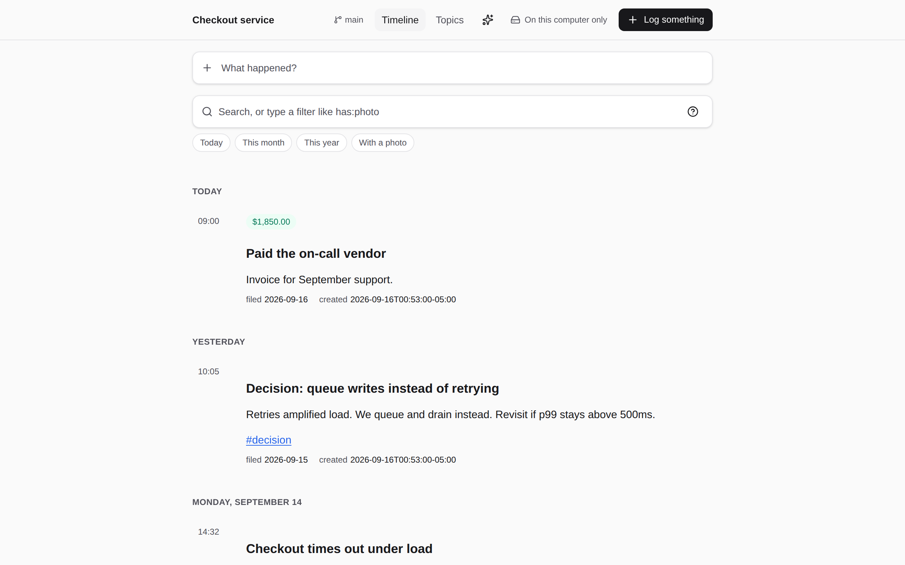

# GitRoll

**A private logbook that lives in your own Git repository. Log what happened, find it later.**

Decisions, incidents, deployments, experiments, the thing that broke at 3am and the thing that
fixed it — written down next to the work, in plain Markdown, in a repository you control.



## One example, end to end

An incident happens. You write it down, attach the evidence, and find it again in November.

```bash
# 1. Log it, from the repository the work happened in
cd ~/code/checkout
gitroll log --template incident --code --editor "Checkout times out under load"

# 2. Keep the evidence with it
gitroll log "p99 after the 14:10 deploy" flamegraph.png

# 3. Find it later — words, tags, dates, amounts
gitroll find "checkout tag:incident after:2026-09-01"
```

What that wrote is an ordinary Markdown file you can read on GitHub, in a text editor, or with
`cat` — no database, no export, nothing to migrate off:

```markdown
---
date: 2026-09-14T14:32:00-05:00
filed: 2026-09-14
source: { repo: acme/checkout, branch: main, commit: 9f1c2d3 }
---

# Checkout times out under load

p99 went from 300ms to 9s after the 14:10 deploy. Rolled back; the index dropped in 9f1c2d3
is the cause. #incident


```

**You don't need GitRoll to keep one.** Create the file yourself, commit it, push it, done. GitRoll
is an app that reads and writes exactly this, and everything it can do, you can do with a text
editor. The whole format is in [SPEC.md](SPEC.md); how entries are grouped into files, archived and
merged is in [docs/STORAGE.md](docs/STORAGE.md).

## Who it's for

GitRoll needs Git and Node, and its sharpest features — `--code` references, GitHub and CI imports,
branch-aware status, the CLI's JSON contract — are for **people who write software**. That is the
first audience: a log of decisions and incidents that lives beside the code it is about.

It works just as well for a household log of receipts, repairs and warranties, and the format is
deliberately plain enough for that. Be aware of one gap before you choose it for that: there is no
mobile app yet, so capturing a receipt photo means getting it onto a computer first.

**Recommended setup: a dedicated private repository.** Keep your notes and attachments separate
from your code. You can also store a Roll inside an existing project — see
[Adding a log to a project you already have](#adding-a-log-to-a-project-you-already-have) for what
that means for who can read it.

**GitRoll is free and source available.** There are no accounts, subscriptions, usage limits,
telemetry or servers. Use it at home and at work, including for paid client work, on as many
computers and Rolls as you like. The one thing you may not do is use GitRoll to build a product that
competes with GitRoll or with GitRoll.com. See [License](#license).

## Install

GitRoll needs [Git](https://git-scm.com/downloads) and [Node.js](https://nodejs.org) 20 or newer.

**Homebrew (Mac or Linux):**

```bash
brew install jimhoyd-com/tap/gitroll
```

**Mac or Linux without Homebrew:** download and run the installer. It fetches the latest release, verifies its SHA-256 checksum, and installs it.

```bash
curl -fsSL https://raw.githubusercontent.com/jimhoyd-com/gitroll/main/scripts/install.sh -o install.sh
```

```bash
sh install.sh
```

**Windows, with [Scoop](https://scoop.sh):**

```powershell
scoop bucket add gitroll https://github.com/jimhoyd-com/scoop-bucket
scoop install gitroll/gitroll
```

**Any system with Node.js, from npm:** published with [provenance](https://docs.npmjs.com/generating-provenance-statements), so you can check it was built by this repository's release workflow.

```bash
npm install --global gitroll
```

Every release is tested by installing it on clean Linux, macOS and Windows machines, with Homebrew and with Scoop, before it's published. Each release also has the package and `SHA256SUMS` on the [releases page](https://github.com/jimhoyd-com/gitroll/releases/latest) if you'd rather download and check it yourself.

For one-command GitHub backup and sharing, also install the [GitHub CLI](https://cli.github.com) and run `gh auth login`. It's optional — backing up to a folder needs nothing beyond GitRoll.

## Start

Log something. There is nothing to set up first:

```bash
gitroll log "Fixed the kitchen tap #plumbing $40"
```

If you don't have a Roll yet, GitRoll makes one in `~/GitRoll` and puts your entry in it. To name it yourself, and to back it up to a new **private** GitHub repository, run `gitroll setup` instead.

Either way, after that:

```bash
gitroll
```

GitRoll opens right in your terminal: use ↑↓ to browse, `n` to log, `/` to find and `q` to quit. Prefer clicking? Press `o` (or run `gitroll open`) to use it in your browser; keep the terminal open while you do.

In the browser:

- **Log:** start typing in the box at the top and click **Save** (or press `n` from anywhere, and `Ctrl`/`⌘`+`Enter` to save). Text is Markdown, `#tags` and amounts like `$40` are picked up as you type, and photos and files can be dropped or pasted straight in. The row of buttons under the box sets the date, the tags and the amount — including logging something that happened last week.
- **Find:** type words in **Search**, or a filter like `has:photo`, `tag:house`, `after:2026-01-01` or `amount:>500`. Suggestions appear as you type; press `/` to jump to the box. The same filters work in `gitroll find`.
- **Edit:** open an event and click **Edit**. **History** shows every earlier version, and puts any of them back.
- **Deleted by mistake:** the link under the timeline lists everything that has left this Roll and puts any of it back — and the message right after a delete offers the same thing. Either way it's a new commit, so the deletion stays in the history too.
- **Back up:** to a folder — an external drive, a network share — with `gitroll backup "/Volumes/Backup/my-roll.git"`, which makes the repository for you and needs no account; or to a private GitHub repository with `gitroll backup` once the GitHub CLI is signed in. GitRoll never uploads on its own. An entry is saved the moment you write it — the terminal, the browser and `gitroll status` all answer the same question the same way, from *Saved on this computer only* to *Saved and backed up* — and sending it to your backup is something you ask for — `gitroll sync`, `/sync` in the terminal app, or the indicator in the header of the browser app, which shows how far behind the backup is and why a sync failed.
- **Filing periods:** the link under the timeline lists each month of entries and archives one — out of the timeline and out of search until you ask for it, with nothing deleted and every link still working.
- **Keyboard:** press `?` for the full list of shortcuts.

If the page asks you to open GitRoll from the link in your terminal, copy that link. It's a per-session key that keeps other programs on your computer out.

## If you write code

A log that lives in the repository it is about answers the questions Git can't: why this, what we tried, what broke at 3am and what fixed it.

```bash
cd ~/code/my-project
gitroll log --template incident --code --editor "Checkout timeouts"
```

- **`--template`** opens one of `debugging`, `incident`, `deployment`, `experiment` or `decision` (an ADR) — headings worth answering, which you can delete if they don't apply.
- **`--code`** records the repository, branch and commit you're on, so the event knows which work it is about.
- **`--editor`** writes it in `$VISUAL` or `$EDITOR`.

Then `#412`, `owner/repo#412`, a commit SHA or a GitHub URL in the text become links to the right repository, and an ordinary Markdown link to another event (`[the incident](2026-09-14-checkout-timeouts.md)`) shows up on both events — the second one as a backlink.

The header (in the browser and the terminal) and `gitroll status` show which repository and **branch** the log itself is on, so you always know where what you write is going. `gitroll completion bash|zsh|fish` prints a completion script for commands, Rolls, templates, tags and saved searches.

| Command | What it does |
| --- | --- |
| `gitroll history` / `gitroll restore <entry>` | Everything removed from the Roll, and one way to put anything back — an earlier version or a deleted entry |
| `gitroll conflicts` / `gitroll resolve <file> --mine` | Settle an event that was changed in two places |
| `gitroll related <file>` | What it links to, and what links back |
| `gitroll find "tag:incident" --save incidents` | Keep a search; run it later with `gitroll find @incidents` |
| `gitroll find "postgres" --all` | Search every Roll you have |

## Adding a log to a project you already have

Run `gitroll` inside any Git repository. If it has no log yet, GitRoll offers to add one, to open a different Roll, or to cancel — and it creates nothing until you say so:

```bash
cd ~/code/my-project
gitroll
```

Choosing *Add a log to this repository* creates `.gitroll/` and nothing else. Your project's own README, files and branch are untouched, and GitRoll commits only the files it wrote, so anything you had staged or half-finished stays exactly as it was. From then on, decisions, incidents and releases live next to the code they are about:

```
.gitroll/events/2026-09-15-auth-decision.md
```

### Before you put a Roll in a project repository

**A dedicated private repository is the recommended setup.** Keeping a Roll inside a project you
already have is supported and always will be — it is just worth knowing, once, what it means:

- Notes and attachments inherit that repository's visibility and access permissions.
- In a public repository, committed and pushed notes are public.
- In a private repository, anyone with access to the repository can read them.
- An ordinary `git push` can upload tracked GitRoll files, whatever GitRoll's own privacy checks
  would have said.
- Changing the repository's visibility later exposes records that were private when you wrote them.
- Deleting a file, or adding it to `.gitignore`, does not remove what is already in the history.

GitRoll says this once, when you add a log to a repository that already holds something else, and
never again on save. Avoid recording personal or sensitive information in a repository other people
can read.

## Your data lives in your own repository

You don't fork or clone this repository to use GitRoll; it holds only the app's source code. `gitroll setup` creates a separate **private** repository in your own GitHub account for your Roll, containing only your events and files. (A fork of this public repository couldn't be made private.)

## Upgrading

Your Rolls contain no app code, so upgrading never changes them: new versions read the same files. `.gitroll/config.yaml` records which template revision your repository follows:

```yaml
template_version: 1
```

GitRoll reads that marker and never changes it while logging or editing — upgrading the app does not upgrade your repository. If a future version ever needs to change the format, it will say so, make the change as a normal commit you can review, and update the marker only once that has worked. A repository whose template is newer than your app refuses writes and tells you to upgrade; one that doesn't record a version is reported as unknown rather than assumed to be current (`gitroll template --set 1` records it).

| How you installed | Upgrade with |
| --- | --- |
| Homebrew | `brew upgrade gitroll` |
| Scoop (Windows) | `scoop update gitroll` |
| The installer, or npm | `npm install --global gitroll@latest`, or run the installer again |
| From source | `git pull && npm ci && npm run build` |

Not sure which one? `gitroll version` says how it was installed and prints the line to run. GitRoll doesn't install software itself: whatever you used to install it upgrades and removes it.

## Uninstalling

Uninstalling removes the app only. **Your Rolls are never deleted:** they're ordinary folders (in `~/GitRoll` by default) and your private GitHub repositories, and they keep working if you reinstall later.

`gitroll uninstall` prints the command for the way you installed it, and lists every Roll it is leaving alone. It never removes anything itself.

| How you installed | Uninstall with |
| --- | --- |
| Homebrew | `brew uninstall gitroll` |
| Scoop (Windows) | `scoop uninstall gitroll` |
| The installer, or npm (Mac, Linux, Windows) | `npm uninstall --global gitroll` |
| Mac or Linux, any method | [`scripts/uninstall.sh`](scripts/uninstall.sh): download it, read it, then run `sh uninstall.sh` (add `--remove-settings` to also remove settings) |

GitRoll's settings — your list of Rolls and trusted backups — are in `~/.config/gitroll` or `%APPDATA%\GitRoll`. Delete that folder to remove them; it holds no events.

To delete a Roll as well, remove its folder and, if you backed it up, delete its repository on GitHub. That's permanent.

## Advanced: start from the template

Prefer to skip `gitroll setup`? Every release publishes the starter files to [jimhoyd-com/gitroll-template](https://github.com/jimhoyd-com/gitroll-template):

1. Click **Use this template → Create a new repository**, and choose **Private**.
2. Clone your new repository:

   ```bash
   git clone git@github.com:you/my-roll.git
   ```

3. Log something — with or without GitRoll:

   ```bash
   cd my-roll
   $EDITOR .gitroll/events/2026-09-15-ac-serviced.md
   git add .gitroll && git commit -m "AC serviced" && git push
   ```

   Or open it in the app, which checks the log, adds it to your list, and opens it:

   ```bash
   cd my-roll && gitroll
   ```

   To add it without opening, run `gitroll rolls add .` instead.

Running `gitroll` inside an **empty** folder offers to make it a Roll; inside a repository that already holds a project, it offers to add a `.gitroll/` folder to it. Either way it asks first and never touches anything else.

## Everyday commands

```bash
gitroll log "AC serviced, capacitor replaced. $325" invoice.pdf
```

```bash
gitroll find "capacitor"
```

```bash
gitroll sync
```

| Command | What it does |
| --- | --- |
| `gitroll` | Open GitRoll in the terminal (`/web` opens the browser app) |
| `gitroll open` | Open GitRoll in your browser |
| `gitroll upgrade` / `gitroll uninstall` | Get the latest version, or remove the app (your Rolls stay) |
| `gitroll menu` or `gitroll -i` | The workspace: type an entry at the prompt, `/` for commands, ↑↓ to browse |
| `gitroll log "text" [files]` | Log something, with optional photos or receipts |
| `gitroll find "words"` | Find events (see [What search looks at](#what-search-looks-at)) |
| `gitroll sync` | Back up, and get changes from anyone you share with |
| `gitroll rolls` / `gitroll switch <name>` | See your Rolls and pick one |
| `gitroll rolls add [folder]` | Add a repository with a log that you cloned yourself |
| `gitroll init --dir <folder>` | Add a log (`.gitroll/`) to a repository you already have |
| `gitroll move <file> <new path>` | Rename or reorganize an event, keeping its links and history |
| `gitroll template` | Show the repository's template version (`--set 1` records one) |
| `gitroll new "Business" --github` | Create another Roll with a private GitHub backup |
| `gitroll share <github-user>` | Let someone else log in this Roll |
| `gitroll log --template incident --code` | Start from a template, recording the branch and commit you're on |
| `gitroll history` / `gitroll restore <entry>` | What changed or was removed; put a version or a deleted entry back |
| `gitroll completion <shell>` | Completion for bash, zsh or fish |
| `gitroll doctor` | Check your setup, privacy and backup |
| `gitroll help more` | Everything else |

### Interactive or basic

- **Interactive:** `gitroll` (or `gitroll menu` / `gitroll -i`) opens a workspace that stays open. Your recent entries sit above a prompt; type what happened and press Enter to log it. Press `/` for commands with descriptions and autocomplete — `/log`, `/find`, `/roll`, `/sync`, `/status`, `/problems`, `/history`, `/web`, `/help` — and `?` for the key list.

  | Key | What it does |
  | --- | --- |
  | Enter | Log what's in the prompt, or open the entry you picked |
  | ↑ ↓ | Pick one of the recent entries above the prompt |
  | Ctrl+O | Open the full composer: text over several lines, date, amount, tags and files, with tag autocomplete |
  | Ctrl+S | Save, in the composer |
  | Ctrl+E | Edit the text in your own editor (`EDITOR` or `VISUAL`) |
  | Ctrl+Z | Undo the last deletion |
  | Ctrl+R | Re-read the Roll from its folder |
  | Esc | Go back, one step at a time |
  | Ctrl+C | Quit — unsaved text is kept as a draft and offered again next time |

  `/find` searches as you type, shows the selected entry beside the results in a wide terminal, and gives you `Ctrl+O` to write a new entry, `Ctrl+E` to edit, `Ctrl+K` to duplicate and `Ctrl+D` to delete. Open an entry with Enter to edit (`e`), duplicate (`y`), attach files (`a`), open one of its files in the application that normally opens it (`o`, `Tab` to pick another), see its history (`h`) or delete it (`d`). Attached files are copied into `.gitroll/files/` and linked from the event, so the originals can move or go; unlinking one leaves the copy where it is, since another event may link the same file. Deleting an event only takes it off the timeline: `/history` lists what has gone and puts any of it back as a new change (`/deleted` still finds it). The header always says which Roll you're in, where it lives, and whether your entries are backed up. In a simple terminal it falls back to a numbered menu. Also, `gitroll log` with no text asks what happened, which files to attach (you can drag them into the terminal), and which tags.
- **Basic:** every command also works in one line with no questions asked, for scripts and automation. Prompts and colors are off automatically outside a terminal, when `NO_COLOR` is set, or with `--plain`.

### What search looks at

`gitroll find`, `/find` in the terminal app and the search box in the browser all read the same thing: **what you wrote.**

| Searched | Not searched |
| --- | --- |
| The words of an event, and its title | What's inside an attached file — no PDF text, no text in photos |
| Its tags | Other Rolls, unless you ask with `--all` |
| Its amount and currency | Events you deleted (`gitroll history`, or Removed in the browser, lists those) |
| Anything in its front matter | Older versions of an event (`gitroll history <id>` shows those) |
| Its file name, and the names of files attached to it | |

It covers this Roll as its files are right now, on the branch you're on. Filters combine: `tag:house tag:payment type:expense after:2026-01-01 before:2026-06-30 amount:>500 has:photo by:jimmy`.

## How entries are stored

New Rolls group entries into one Markdown file per month, and roll over into `09-002.md`,
`09-003.md` as a month fills up. Rolls created before this release keep one file per event until
you migrate them deliberately.

```bash
gitroll storage                              # grouping, time zone, rollover targets, archiving
gitroll storage --mode monthly --timezone America/Chicago
gitroll migrate --to monthly --dry-run       # preview moving what's already here
gitroll archive 2026-09 --compress           # put a month out of the way (nothing is deleted)
gitroll find "boiler" --include-archive      # archives are excluded until you ask
gitroll usage                                # what the Roll costs, attachments counted apart
```

A Roll has one time zone, and an entry is filed by the day it happened *there* — so
`2026-10-01T02:00:00Z` is September in `America/Chicago`, wherever the laptop is. Entries carry a
permanent id, so links survive rollover, migration and archiving, and sync merges shared files
entry by entry rather than line by line. The details, including what gzip does and does not do, are
in [docs/STORAGE.md](docs/STORAGE.md).

## Sharing a Roll

```bash
gitroll share partner-github-name
```

They accept the GitHub invitation, install GitRoll, and run `gitroll join you/home`. Everyone syncs with the same private repository. If two people edit the same entry, GitRoll keeps both versions and tags the entry `#conflict`. See [docs/SHARING.md](docs/SHARING.md).

## Templates and themes

Start new Rolls from a template repository, and restyle GitRoll with a small CSS file. See [docs/TEMPLATES.md](docs/TEMPLATES.md).

## Privacy

- Your events live only on your computer and, if you back up, in your own GitHub repository. GitRoll collects nothing and keeps no copy.
- A log is as visible as the repository it is in. `.gitroll/` is a namespace, not a privacy boundary: in a public repository, the log is public.
- It removes location data from photos, and warns before you save something that looks like a password or card number.
- Before every sync it confirms your backup repository is private, and refuses to upload if it's public or it can't tell. It only opens on your own computer.
- **Limitations:** files aren't encrypted, and deleting an entry doesn't erase it from history.

Details are in [SECURITY.md](SECURITY.md).

## For developers

### Using GitRoll from an AI agent

Run `gitroll help agent --json` for an offline agent guide. `gitroll schema`
lists commands, arguments, accepted flags, side effects and output contracts;
`gitroll schema edit` or `gitroll edit --help` describes one command.

```bash
gitroll find 'tag:incident' -C /path/to/roll --json --limit 10 --fields path,title
gitroll log 'Fixed checkout timeout' -C /path/to/roll --json --idempotency-key incident-412
```

`--json` implies `--non-interactive`: GitRoll won't prompt, open an editor, or
launch a workspace/browser. Commands that do not support JSON reject it before
running. Unsupported flags also fail before execution: `log --dry-run` cannot
accidentally write an event. Use `gitroll schema <command>` to discover what is
supported.

JSON results go to stdout. Thrown errors go to stderr as
`{ "error": { "code": "…", "message": "…" } }` and exit 1. Diagnostic commands
such as `check` and `sync` return their JSON report on stdout even
when they exit 1. Always check the exit status.

Use the same idempotency key and input to retry a log without another commit.
Keys survive edits, moves and clones; deleting an event or its source metadata
releases its key. For edits, read the `revision` from `show --json` and pass it
back with `edit --expect <revision>` to reject a stale edit. `find`, `today`, and
`recent` accept `--limit`, `--offset`, and JSON `--fields` selection. Offset pages
reflect the current files, so concurrent changes can shift results.

Logging and editing commit locally; uploading requires an explicit sync. For
an unattended workflow, pass text explicitly or pipe it into `log`, select the
Roll with `-C` or `--roll`, and avoid editor options. See [docs/CLI.md](docs/CLI.md)
for the full automation contract.

Every event is a Markdown file, front matter optional, so `git clone` gives you everything and your records stay readable — and writable — without GitRoll. The format is specified in [SPEC.md](SPEC.md).

```bash
make setup
```

```bash
make check
```

```bash
make demo
```

Run `make` to list every shortcut. See [CONTRIBUTING.md](CONTRIBUTING.md) to contribute and [packaging/README.md](packaging/README.md) for releases.

| Path | What it is |
| --- | --- |
| `src/core` | The GitRoll format: parsing, validation, search, privacy checks — platform-free, so the same rules run in Node and in the browser |
| `src/node` | Git operations, the CLI and the local web server |
| `src/web` | The browser interface |
| `template` | Starter files for a new Roll: a `.gitroll/` folder and a short root README (data only: no code or workflows) |

## GitRoll.com

GitRoll.com is an optional, separate, paid service for using your Rolls from any browser or phone. It isn't part of this repository, and the free app never needs it. Your Rolls work the same with or without it.

## License

GitRoll 0.4.0 and later is licensed under the [PolyForm Shield License 1.0.0](LICENSE).

GitRoll is **source available**, not open source: the source is public and you
may read, run, change and share it, but one purpose is carved out. It does not
meet the Open Source Definition, and saying otherwise would be inaccurate.

**Free, no permission needed:**

- Personal use, on any number of computers and Rolls.
- Use inside a company, of any size, for its own work.
- Paid work for clients — consulting, contracting, agency work — where GitRoll
  is a tool you use rather than the product you sell.
- Reading, changing, forking and sharing the source, with the notices kept.

**Needs a separate license from me:**

- Providing a product or service that competes with GitRoll or with GitRoll.com,
  including a hosted or managed GitRoll, free or paid.
- Reselling GitRoll, or bundling it into a product sold as a substitute for it.

If you want to do something in the second list, email jimhoyd@gmail.com — commercial
licenses are available and I would rather say yes than have you guess.

Common questions — using it at work, billing clients for work logged in it,
forking it, running it for a team — are answered in
[docs/LICENSE-FAQ.md](docs/LICENSE-FAQ.md).

**Earlier versions stay MIT.** Releases through 0.3.0 were published under the
MIT License and remain under it forever, with every permission it granted. See
[LICENSE-MIT-HISTORICAL](LICENSE-MIT-HISTORICAL).

Bundled third-party components keep their own licenses, which this change does
not affect; they are listed in `dist/THIRD_PARTY_NOTICES.txt`.
